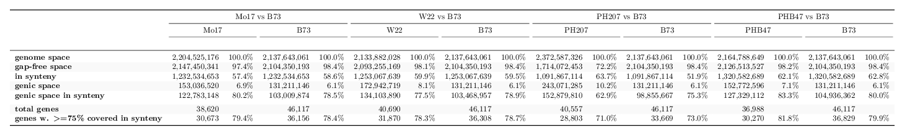
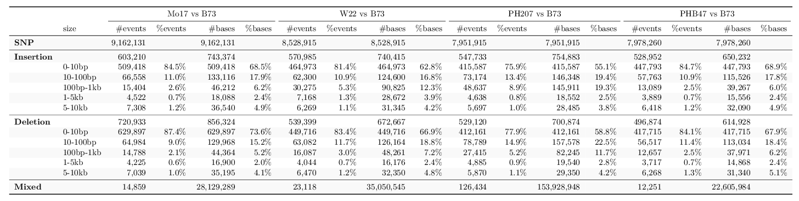
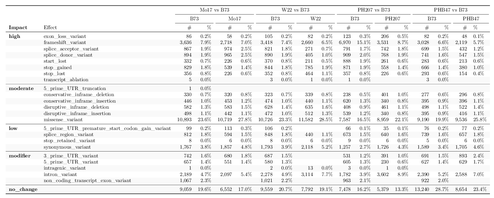

Whole genome comparison of maize assemblies
================
October 27, 2018

  - whole genome synteny plots
      - [Mo17 vs B73](/data/07_dotplot/Mo17_B73.pdf)
      - [W22 vs B73](/data/07_dotplot/W22_B73.pdf)
      - [PH207 vs B73](/data/07_dotplot/PH207_B73.pdf)
      - [PHB47 vs B73](/data/07_dotplot/PHB47_B73.pdf)
  - Table 1. Whole genome alignment statistics.

<!-- -->

  - Table 2. Summary of variants called by synteny comparison.

<!-- -->

  - Table 3. Summary of variant effects on syntenic genes.

<!-- -->
